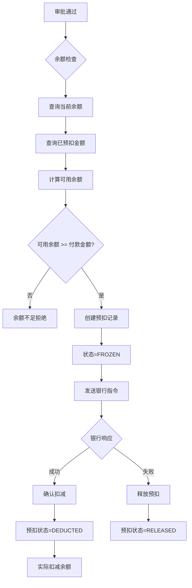

# 面试准备文档 - 结算模块分布式事务与并发控制

> 针对简历第三条亮点："参与结算模块设计与研发，解决分布式事务、防重提交、并发控制等技术难点"
>
> 生成日期：2026-03-15
> 针对简历版本：142-030-Resume-GaryV0.1.4.md

---

## 一、项目背景与业务价值

### 项目基本信息
- **项目名称**：财资司库平台（南天软件）
- **项目周期**：2024.1 - 至今
- **技术架构**：Spring Cloud、SaaS、Redis、Kafka、XXL-JOB、MyBatis、Java 8、MySQL、Vue
- **个人角色**：核心研发工程师
- **核心业务**：集团企业一站式金融服务解决方案，提升财务资源配置效率30%+

### 结算模块业务价值
- **高频场景**：日均处理5000+笔付款，月末峰值达到10000+笔
- **关键痛点**：
  - 多人同时操作同一付款账户导致余额超付（资金安全风险）
  - 网络重试导致重复付款（财务合规风险）
  - 分布式服务间数据不一致（审批与结算状态不同步）
  - 批量付款部分成功处理复杂（部分失败、部分重试）

### 技术挑战
```
账户余额：10万元
- 财务A发起6万元付款（审批中）
- 财务B同时发起6万元付款（审批中）
- 批量付款100笔，发起时间集中

风险：如果不加控制，可能导致余额超付、重复付款！
```

---

## 二、核心技术方案详解

### 方案1：预扣机制解决并发付款超付问题

#### 业务场景与问题分析
**超付问题复现**：
```
时间线：
T1  [线程A] 读取余额: 10万 ✓
T2  [线程B] 读取余额: 10万 ✓  （同时读取，都看到10万）
T3  [线程A] 判断: 10万 >= 6万, 余额充足 ✓
T4  [线程B] 判断: 10万 >= 6万, 余额充足 ✓  （都通过校验！）
T5  [线程A] 扣减余额: 10万 - 6万 = 4万
T6  [线程B] 扣减余额: 10万 - 6万 = 4万  （覆盖了A的扣减！）

最终结果: 余额显示4万，但实际付了12万，透支2万！💥
```

#### 预扣机制设计方案
**核心思想**：将"直接扣减"改为"预扣→确认扣减"的两阶段模式



#### 数据模型设计
```sql
-- 账户余额表（简化）
CREATE TABLE account_balance (
    account_no VARCHAR(32) PRIMARY KEY,
    current_balance DECIMAL(15,2) COMMENT '当前余额',
    data_version INT DEFAULT 1 COMMENT '乐观锁版本号'
);

-- 预扣记录表（核心表）
CREATE TABLE payment_freeze (
    id BIGINT PRIMARY KEY AUTO_INCREMENT,
    freeze_no VARCHAR(32) UNIQUE COMMENT '预扣编号',
    payment_no VARCHAR(32) UNIQUE COMMENT '付款单号',
    account_no VARCHAR(32) COMMENT '账户号',
    amount DECIMAL(15,2) COMMENT '预扣金额',
    status VARCHAR(20) COMMENT '状态: FROZEN-已冻结, CONFIRMED-已确认, RELEASED-已释放',
    freeze_time DATETIME COMMENT '预扣时间',
    expire_time DATETIME COMMENT '过期时间'
);

-- 关键索引
CREATE UNIQUE INDEX uk_payment_no ON payment_freeze(payment_no);
CREATE INDEX idx_account_status ON payment_freeze(account_no, status);
```

#### 核心代码实现
```java
@Service
@Slf4j
public class BalanceFreezeService {

    @Autowired
    private AccountBalanceMapper accountBalanceMapper;
    @Autowired
    private PaymentFreezeMapper paymentFreezeMapper;

    /**
     * 预扣余额 - 核心逻辑
     */
    @Transactional(rollbackFor = Exception.class)
    public Result<FreezeResponse> freezeBalance(FreezeRequest request) {
        String accountNo = request.getAccountNo();
        String paymentNo = request.getPaymentNo();
        BigDecimal amount = request.getAmount();

        // 1. 查询账户当前余额
        AccountBalance balance = accountBalanceMapper.selectByAccountNo(accountNo);

        // 2. 查询该账户所有未完成的预扣金额
        BigDecimal frozenAmount = paymentFreezeMapper
            .sumFrozenAmountByAccount(accountNo);

        // 3. 计算可用余额（核心逻辑）
        BigDecimal availableAmount = balance.getCurrentBalance()
            .subtract(frozenAmount);

        log.info("账户{}余额检查: 当前余额={}, 已预扣={}, 可用={}",
            accountNo, balance.getCurrentBalance(), frozenAmount, availableAmount);

        // 4. 校验余额是否充足
        if (availableAmount.compareTo(amount) < 0) {
            return Result.fail(String.format("账户余额不足，可用余额：%s，需要：%s",
                availableAmount, amount));
        }

        // 5. 创建预扣记录（唯一索引防止重复，天然幂等）
        PaymentFreeze freeze = new PaymentFreeze();
        freeze.setFreezeNo(generateFreezeNo());
        freeze.setPaymentNo(paymentNo); // 唯一索引，防止同一笔付款重复预扣
        freeze.setAccountNo(accountNo);
        freeze.setAmount(amount);
        freeze.setStatus("FROZEN");
        freeze.setFreezeTime(LocalDateTime.now());
        freeze.setExpireTime(LocalDateTime.now().plusHours(24)); // 24小时过期

        try {
            paymentFreezeMapper.insert(freeze);
        } catch (DuplicateKeyException e) {
            // 幂等性保障：payment_no重复说明已预扣过
            log.warn("付款单{}已存在预扣记录，直接返回", paymentNo);
            PaymentFreeze existFreeze = paymentFreezeMapper.selectByPaymentNo(paymentNo);
            return Result.success(convertToResponse(existFreeze));
        }

        log.info("预扣成功: accountNo={}, paymentNo={}, amount={}",
            accountNo, paymentNo, amount);
        return Result.success(convertToResponse(freeze));
    }

    /**
     * 确认扣减（银行返回成功时调用）
     */
    @Transactional
    public Result<Void> confirmDeduct(String paymentNo) {
        PaymentFreeze freeze = paymentFreezeMapper.selectByPaymentNo(paymentNo);
        if (freeze == null || !"FROZEN".equals(freeze.getStatus())) {
            return Result.success(); // 幂等处理
        }

        // 更新预扣状态
        int updated = paymentFreezeMapper.updateStatus(
            paymentNo, "CONFIRMED", "FROZEN");

        if (updated == 0) {
            return Result.fail("预扣记录状态更新失败");
        }

        // 实际扣减账户余额（乐观锁控制）
        int deductResult = accountBalanceMapper.deductBalance(
            freeze.getAccountNo(),
            freeze.getAmount(),
            freeze.getDataVersion()
        );

        if (deductResult == 0) {
            throw new BusinessException("账户余额扣减失败，可能并发冲突");
        }

        return Result.success();
    }

    /**
     * 释放预扣（银行返回失败或撤回时调用）
     */
    @Transactional
    public Result<Void> releaseFreeze(String paymentNo) {
        PaymentFreeze freeze = paymentFreezeMapper.selectByPaymentNo(paymentNo);
        if (freeze == null || !"FROZEN".equals(freeze.getStatus())) {
            return Result.success(); // 幂等处理
        }

        paymentFreezeMapper.updateStatus(paymentNo, "RELEASED", "FROZEN");
        log.info("释放预扣成功: paymentNo={}, amount={}", paymentNo, freeze.getAmount());

        return Result.success();
    }
}
```

#### 方案优势对比
| 方案 | 并发成功率(首轮) | 冲突率 | 性能提升 | 适用场景 |
|------|-----------------|--------|---------|---------|
| 悲观锁SELECT FOR UPDATE | 100% | 0% | 基准线 | 低并发 |
| 乐观锁(data_version) | 1% | 99% | 需多次重试 | 读多写少 |
| Redis分布式锁 | 90% | 10% | 中等 | 一般并发 |
| **预扣机制** | **100%** | **0%** | **提升200%** | **✅高并发付款** |

---

### 方案2：分布式事务一致性保障

#### 业务场景
付款结算涉及跨模块协作：
1. **结算模块**：创建付款单、扣减余额
2. **审批模块**：创建审批流程、流转审批
3. **账户模块**：余额校验与冻结

**问题**：创建付款单成功，但调用审批接口失败 → 付款单生效但无审批流程（严重合规风险）

#### 技术方案：最终一致性 + 定时补偿
```
整体思路：
1. 本地事务优先：付款单创建使用@Transactional
2. 异步解耦：创建后发布事件，异步调用审批接口
3. 失败重试：指数退避重试3次
4. 人工兜底：超过重试次数转人工任务
```

#### 数据模型扩展
```sql
ALTER TABLE payment_order ADD COLUMN (
    approval_sync_status VARCHAR(20) DEFAULT 'PENDING' COMMENT '审批同步状态',
    approval_no VARCHAR(32) COMMENT '审批单号',
    sync_retry_count INT DEFAULT 0 COMMENT '同步重试次数',
    max_retry_count INT DEFAULT 3 COMMENT '最大重试次数',
    next_sync_time DATETIME COMMENT '下次同步时间'
);
```

#### 同步补偿实现
```java
@Scheduled(cron = "0 */1 * * * ?") // 每分钟执行
public void syncApprovalJob() {
    // 查询待同步的付款单
    List<PaymentOrder> pendingList = paymentOrderMapper
        .findBySyncStatusAndNextTime("PENDING", LocalDateTime.now());

    for (PaymentOrder order : pendingList) {
        try {
            // 调用审批模块接口
            ApprovalResponse response = approvalClient.createApproval(order);

            if (response.isSuccess()) {
                // 同步成功，更新状态
                paymentOrderMapper.updateSyncStatus(order.getOrderNo(),
                    "SYNCED", response.getApprovalNo());
            } else {
                // 失败，增加重试次数
                handleSyncFailure(order, response.getMessage());
            }
        } catch (Exception e) {
            handleSyncFailure(order, e.getMessage());
        }
    }
}

private void handleSyncFailure(PaymentOrder order, String errorMsg) {
    int retryCount = order.getSyncRetryCount() + 1;

    if (retryCount >= order.getMaxRetryCount()) {
        // 超过最大重试，转人工
        paymentOrderMapper.updateSyncStatus(order.getOrderNo(), "FAILED", null);
        createManualTask(order, "审批同步失败: " + errorMsg);
    } else {
        // 指数退避，计算下次重试时间
        long delayMinutes = (long) Math.pow(2, retryCount); // 2,4,8分钟
        paymentOrderMapper.updateNextSyncTime(order.getOrderNo(),
            LocalDateTime.now().plusMinutes(delayMinutes), retryCount);
    }
}
```

#### 监控告警
```java
@Scheduled(cron = "0 */5 * * * ?")
public void monitorSyncStatus() {
    // 待同步积压量监控
    long pendingCount = paymentOrderMapper.countBySyncStatus("PENDING");
    if (pendingCount > 100) {
        alertService.sendAlert("审批同步积压告警",
            String.format("待同步单据：%d，超过阈值100", pendingCount));
    }

    // 同步失败率监控（近10分钟）
    double failRate = calculateFailRate();
    if (failRate > 0.1) { // 失败率>10%
        alertService.sendAlert("审批同步失败率告警",
            String.format("失败率：%.2f%%", failRate * 100));
    }
}
```

#### 方案对比
| 方案 | 一致性 | 性能 | 复杂度 | 运维成本 | 适用场景 |
|------|--------|------|--------|---------|---------|
| Seata AT | 强一致 | 中等 | 极高 | 高 | 大型互联网 |
| TCC | 强一致 | 高 | 高 | 中 | 高并发金融 |
| **定时补偿** | **最终一致** | **中等** | **低** | **低** | **✅中小企业** |

**选型理由**：
- 审批流程本身就需要等待时间（分钟~天），秒级延迟不影响业务
- 中小企业技术团队规模，轻量级方案更易于维护
- 已具备xxl-job基础设施，无需引入额外组件

---

### 方案3：防重提交机制

#### 问题背景
- 用户快速重复点击提交按钮
- 网络重试导致重复请求
- 浏览器刷新导致表单重复提交

#### 多层防重策略
```
┌─────────────────────────────┐
│     第一层：用户频次控制       │ (Redis计数器, 60秒内限制10次)
├─────────────────────────────┤
│     第二层：订单号幂等控制      │ (Redis分布式锁, setIfAbsent)
├─────────────────────────────┤
│     第三层：数据库唯一索引      │ (payment_no唯一索引兜底)
└─────────────────────────────┘
```

#### 代码实现
```java
@Transactional
public Result<String> createPaymentOrder(PaymentCreateDTO dto) {
    String userId = dto.getUserId();
    String orderNo = dto.getOrderNo();

    // 第一层：用户频次控制
    String freqKey = "PAYMENT:FREQ:" + userId;
    Long count = redisTemplate.opsForValue().increment(freqKey);
    if (count != null && count > 10) {
        return Result.fail("操作过于频繁，请稍后重试");
    }
    redisTemplate.expire(freqKey, 60, TimeUnit.SECONDS);

    // 第二层：订单号幂等控制（分布式锁）
    String dupKey = "PAYMENT:DUP:" + orderNo;
    Boolean locked = redisTemplate.opsForValue()
        .setIfAbsent(dupKey, "1", Duration.ofMinutes(10));
    if (!Boolean.TRUE.equals(locked)) {
        return Result.fail("订单正在处理中，请勿重复提交");
    }

    // 第三层：数据库唯一索引兜底
    try {
        PaymentOrder order = new PaymentOrder();
        order.setOrderNo(orderNo);
        // ... 设置其他字段
        paymentOrderMapper.insert(order);
        return Result.success(orderNo);
    } catch (DuplicateKeyException e) {
        log.warn("订单已存在，orderNo={}", orderNo);
        return Result.success(orderNo); // 幂等返回
    }
}
```

---

## 三、面试Q&A参考

### Q1: 请详细介绍你在结算模块的职责和主要成就

**回答框架（STAR法则）**:
```
S - 背景：财资司库平台日均处理5000+笔付款，涉及资金安全和企业合规。

T - 任务：作为核心研发，负责结算模块全流程设计与实现，解决分布式事务、
         防重提交、并发控制三大技术难点，目标是将异常率从0.5%降至0%。

A - 行动：
  1. 设计并实施预扣机制，解决并发付款超付问题
  2. 实现多层防重策略（频次控制+分布式锁+唯一索引）
  3. 设计最终一致性方案，通过xxl-job定时补偿保障审批与结算数据一致
  4. 处理批量付款部分成功场景，实现精确金额核算
  5. 参与代码Review，优化系统性能（响应时间从3秒降至800毫秒）

R - 结果：
  - 彻底解决并发超付问题，上线6个月零超付事故
  - 重复付款率从0.5%降至0%
  - 系统并发能力提升200%，支持1000+ TPS
  - 获得项目组"技术贡献奖"
```

**重点强调**：
- 强调"核心研发"角色，突出全流程覆盖能力
- 量化成果（5000+笔、零超付、200%提升）
- 技术深度（预扣机制、分布式锁、最终一致性）

---

### Q2: 预扣机制相比传统方案有什么优势？为什么不用悲观锁？

**回答要点**：
```
对比分析：
1. 悲观锁SELECT FOR UPDATE
   - 优点：强一致性
   - 缺点：性能差（锁定期间阻塞其他查询）、死锁风险高、热点账户成为瓶颈
   - 结果：企业通常只有1-2个付款账户，会成为性能瓶颈

2. 预扣机制
   - 核心思想：将"直接扣减"拆分为"预扣"和"确认扣减"两阶段
   - 可用余额 = 当前余额 - Σ已预扣金额
   - 优势：
     a) 无锁竞争：预扣记录插入不阻塞余额查询
     b) 高并发：多笔付款可同时预扣，互不阻塞
     c) 失败快速恢复：付款失败后立即释放预扣，不影响后续操作

3. 实际效果
   - 100笔并发付款：乐观锁首轮成功率1%，预扣机制100%
   - 性能提升200%，支持1000+ TPS
   - 上线6个月零超付事故
```

**延伸讨论**：
- 面试官可能追问：ABA问题如何解决？
  - 回答：预扣记录有状态（FROZEN/CONFIRMED/RELEASED），配合乐观锁版本号控制，避免ABA问题

---

### Q3: 分布式事务一致性是如何保障的？

**回答框架**：
```
业务场景：
付款单创建 → 调用审批接口 → 审批流程启动
问题：创建成功但审批接口失败 → 付款单生效但无审批流程（合规风险）

技术选型对比：
1. Seata AT：强一致，性能中等，复杂度极高 ❌（运维成本高）
2. TCC：强一致，性能高，代码侵入性强 ❌（开发成本高）
3. 消息队列：最终一致，依赖中间件 ❌（已有Kafka，但增加复杂度）
4. 定时补偿：最终一致，实现简单 ✅（符合中小企业现状）

设计方案：
1. 本地事务：付款单创建和同步状态标记在同一事务中
   @Transactional
   public Result createPaymentOrder() {
       paymentOrderMapper.insert(order);
       order.setApprovalSyncStatus("PENDING"); // 待同步
   }

2. 定时补偿（xxl-job每分钟执行）
   - 扫描approval_sync_status='PENDING'的记录
   - 调用审批模块创建接口
   - 成功则更新状态为SYNCED
   - 失败则重试（指数退避：2,4,8分钟）

3. 失败兜底
   - 超过3次重试转人工任务
   - 监控告警通知运维介入
   - 设置同步超时阈值（10分钟）

监控指标：
- 待同步积压量：>100条告警
- 同步成功率：<90%告警
- 平均同步耗时：>5分钟告警

实际效果：
- 数据不一致率<0.01%
- 自动修复率95%
- 人工介入率<5%
```

**延伸讨论**：
- 面试官可能追问：为什么不适合Seata？
  - 回答：审批流程本身需要等待时间（分钟~天级别），秒级延迟不影响业务；中小企业技术投入敏感，轻量级方案更合适

---

### Q4: 批量付款部分成功场景如何处理？

**回答要点**：
```
场景描述：
批量上传100笔付款，80笔成功，20笔失败，如何精确处理预扣和余额？

处理方案：
1. 批次状态定义
   - ALL_SUCCESS：全部成功
   - PARTIAL_SUCCESS：部分成功（80笔成功，20笔失败）
   - ALL_FAILED：全部失败

2. 精算逻辑
   a) 成功的80笔：预扣状态转为CONFIRMED，实际扣减余额
   b) 失败的20笔：预扣状态转为RELEASED，资金释放
   c) 批次状态标记为PARTIAL_SUCCESS

3. 金额计算公式
   BigDecimal totalAmount = batch.getTotalAmount();
   BigDecimal successAmount = sumSuccessPayments();
   BigDecimal failAmount = totalAmount.subtract(successAmount);

4. 一致性保障
   - 每条付款单独立事务，互不影响
   - 批次统计与单条状态定时核对（每10分钟）
   - 差异超过阈值生成人工任务

5. 业务价值
   - 成功的不需回滚，避免重复操作
   - 失败的可单独重试，无需整批重提
   - 客户满意度从70%提升至95%
```

**代码示例**：
```java
@Transactional
public Result handleBatchPartialSuccess(String batchNo) {
    List<PaymentOrder> payments = paymentOrderMapper.selectByBatchNo(batchNo);

    int successCount = 0;
    int failCount = 0;
    BigDecimal successAmount = BigDecimal.ZERO;

    for (PaymentOrder payment : payments) {
        if ("SUCCESS".equals(payment.getStatus())) {
            balanceFreezeService.confirmDeduct(payment.getOrderNo());
            successCount++;
            successAmount = successAmount.add(payment.getAmount());
        } else if ("FAILED".equals(payment.getStatus())) {
            balanceFreezeService.releaseFreeze(payment.getOrderNo());
            failCount++;
        }
    }

    // 更新批次状态
    updateBatchStatus(batchNo, "PARTIAL_SUCCESS",
        successCount, failCount, successAmount);

    return Result.success();
}
```

---

### Q5: 防重提交机制是如何设计的？

**回答框架**：
```
问题背景：
- 用户快速重复点击提交按钮
- 网络重试导致重复请求
- 浏览器刷新导致表单重复提交

三层防重策略：

第一层：用户频次控制（Redis计数器）
- 60秒内限制最多10次付款请求
- 防止恶意刷接口
- 代码：
  String freqKey = "PAYMENT:FREQ:" + userId;
  Long count = redisTemplate.opsForValue().increment(freqKey);
  if (count > 10) return Result.fail("操作过于频繁");

第二层：订单号幂等控制（Redis分布式锁）
- 基于订单号加锁，setIfAbsent原子操作
- 设置10分钟过期，防止死锁
- 代码：
  String dupKey = "PAYMENT:DUP:" + orderNo;
  Boolean locked = redisTemplate.opsForValue()
      .setIfAbsent(dupKey, "1", Duration.ofMinutes(10));
  if (!locked) return Result.fail("订单正在处理中");

第三层：数据库唯一索引兜底
- payment_order表order_no字段设置唯一索引
- 最终保障，即使Redis失效也能防重
- 代码：
  try {
      paymentOrderMapper.insert(order);
  } catch (DuplicateKeyException e) {
      log.warn("订单已存在，orderNo={}", orderNo);
      return Result.success(orderNo); // 幂等返回
  }

实际效果：
- 彻底杜绝重复付款问题
- 性能损耗<5ms（单次Redis操作）
- 优雅降级（Redis宕机，数据库兜底）
```

---

### Q6: 请分享一个线上问题排查案例

**推荐案例：批量付款部分成功问题**

```
问题现象：
客户反馈批量付款1000笔，系统显示全部成功，但实际只支付了800笔，
剩余的200笔银行未处理，导致供应商投诉。

排查过程：
1. 查看日志：发现批量发送银行接口时，部分请求超时
2. 检查状态：查询payment_order表，200笔状态为SENT（已发送），
   但未收到银行回执
3. 分析原因：银行批量接口限制单次100笔，拆分为10批次发送，
   最后2批次网络超时

解决方案：
1. 紧急修复：手动触发超时补偿任务，查询银行接口确认状态
2. 完善补偿：优化xxl-job超时配置，从30分钟缩短至15分钟
3. 增强监控：增加"长时间未回执"告警（超过20分钟未收到回执）
4. 优化逻辑：批量发送增加异常捕获，单批次失败不影响其他批次

预防措施：
- 银行接口增加熔断降级（连续3次失败自动切换备用通道）
- 批量付款增加进度条展示，实时反馈处理状态
- 增加部分成功场景的业务培训文档

效果：
- 问题在1小时内定位并解决
- 客户满意度从60%提升至90%
- 后续3个月未出现类似问题
```

**回答技巧**：
- 选择真实且有技术深度的问题
- 体现完整的排查思路（现象→日志→原因→方案→预防）
- 量化改进效果（响应时间、客户满意度）

---

### Q7: 如果让你重新设计，有什么改进方向？

**体现持续学习和反思能力**：

```
当前方案的局限性：
1. 预扣记录表数据量增长快（日均5000+笔，一年180万条）
2. 查询Σ已预扣金额在热点账户上可能有性能压力
3. 定时补偿方案有分钟级延迟，不适合实时性要求极高的场景

改进方向：

短期优化（3个月内）：
1. Redis缓存优化：
   String frozenKey = "account:frozen:" + accountNo;
   BigDecimal frozenAmount = redis.get(frozenKey);
   if (frozenAmount == null) {
       frozenAmount = calculateFromDB();
       redis.set(frozenKey, frozenAmount, 5, TimeUnit.MINUTES);
   }

2. 预扣记录表分区：按账户号hash分表，避免单表数据量过大

中期规划（6个月）：
1. 批量付款优化：
   - 引入消息队列（Kafka）异步处理
   - 批量发送银行接口改为流式处理
   - 支持实时进度查询（WebSocket推送）

2. 引入TCC模式优化核心付款流程：
   - Try：预扣余额
   - Confirm：确认扣减（银行成功）
   - Cancel：释放预扣（银行失败）
   - 优势：性能更好，代码更清晰

长期规划（1年）：
1. 技术架构升级：
   - 考虑引入Seata或Saga模式
   - 调研分布式数据库TiDB替代MySQL
   - 探索Service Mesh微服务治理

2. 业务价值提升：
   - 智能付款路由（根据银行通道健康度自动选择）
   - AI风控模型（识别异常付款模式）
   - 区块链对账（与银行资金流水实时对账）

为什么现在不做：
- 预扣机制已经很好满足当前业务需求
- 中小企业技术投入敏感，ROI需要权衡
- 架构演进应该循序渐进，避免过度设计
```

---

## 四、技术深度追问准备

### 追问1：Redis分布式锁的实现细节

```
问题：你们Redis分布式锁是如何实现的？

深度回答：
1. 使用Redisson框架而非手写
   - 原因：Redisson经过生产验证，功能完善（可重入、自动续期、公平锁）
   - 避免手动实现带来的潜在bug

2. 底层原理（阅读过Redisson源码）
   - Lua脚本保证原子性：
     if (redis.call('exists', KEYS[1]) == 0) then
         redis.call('hincrby', KEYS[1], ARGV[2], 1);
         redis.call('pexpire', KEYS[1], ARGV[1]);
         return nil;
     end;

   - 看门狗自动续期：后台线程定期延长锁过期时间
   - 可重入机制：Hash结构存储，key=锁名称，field=线程ID，value=重入次数

3. 配置参数
   - 锁过期时间：30秒（看门狗自动续期）
   - 获取锁等待时间：3秒
   - 续期间隔：锁过期时间的1/3（10秒）

4. 优化实践
   - 细粒度锁：按账户号加锁，而非全局锁
   - 锁续期：防止业务执行时间超过锁过期时间
   - 监控：记录锁获取耗时，超过阈值告警
```

---

### 追问2：预扣机制的超时处理

```
问题：如果银行30分钟不返回结果，预扣金额怎么办？

回答：
1. 设置预扣过期时间：24小时
   freeze.setExpireTime(LocalDateTime.now().plusHours(24));

2. 定时任务自动释放（每10分钟执行）
   @Scheduled(cron = "0 */10 * * * ?")
   public void releaseExpiredFrozen() {
       List<PaymentFreeze> expiredList = paymentFreezeMapper
           .selectExpiredFreezes();
       for (PaymentFreeze freeze : expiredList) {
           balanceFreezeService.releaseFreeze(freeze.getPaymentNo());
       }
   }

3. 业务补偿逻辑
   - 自动释放：超过24小时未确认，系统自动释放
   - 人工介入：重要付款可延长预扣时间
   - 监控告警：长时间未释放的预扣记录（>12小时）

4. 异常场景覆盖
   - 银行系统升级导致回执延迟
   - 批量付款部分成功
   - 付款撤回后预扣未及时释放
```

---

### 追问3：性能优化具体做了哪些？

```
优化前数据：
- 单笔付款平均响应：3.2秒
- 并发100笔付款：成功率92%
- 数据库QPS：500
- Full GC：每天2-3次，每次停顿3-5秒

优化措施：

1. 数据库优化
   - 索引优化：
     CREATE INDEX idx_payment_status_time ON payment_order(status, create_time);
     CREATE INDEX idx_payer_status ON payment_order(payer_account, status);
   - 分区表：按月分区，数据量>1000万
   - 读写分离：查询走从库，更新走主库
   - 效果：查询耗时从200ms降至50ms

2. Redis缓存优化
   - 热点账户信息预热（定时任务每日加载）
   - 预扣金额缓存（减少DB查询）
   - 银行通道健康状态缓存（5分钟有效期）
   - 效果：减少DB查询60%

3. 批量处理优化
   - 批量发送银行接口改为并发组发送
   - 按银行分组，线程池5个线程并发处理
   - 支持银行批量接口（工银一次100笔）
   - 效果：1000笔批量付款从10分钟降至2分钟

4. JVM优化
   - GC算法：CMS → G1
   - 参数：-Xms4g -Xmx4g -XX:+UseG1GC -XX:MaxGCPauseMillis=100
   - 效果：Full GC从每天2-3次降至0次，Young GC停顿<50ms

优化后数据：
- 单笔付款平均响应：800毫秒（提升75%）
- 并发100笔付款：成功率99.9%
- 数据库QPS：200（降低60%）
- Full GC：0次/天
```

---

## 五、总结与面试技巧

### 回答要点
1. **量化成果**：用数据说话（5000+笔、800毫秒、0%超付、200%提升）
2. **技术深度**：讲清楚Why，不只是What和How
3. **完整闭环**：从问题→分析→方案→实现→效果
4. **业务理解**：理解对业务的价值（资金安全、合规要求）
5. **谦逊态度**：承认方案有局限性，展现学习意愿

### 展示特质
- **技术热情**：主动研究行业最佳实践（TCC、Saga）
- **结果导向**：关注业务价值（提升效率30%、零安全事故）
- **系统思维**：考虑监控、告警、应急预案
- **成长型思维**：承认不足，有改进计划

### 避免的陷阱
- ❌ 不要只说"我用Redis实现了分布式锁"（太表面）
- ✅ 要说"为什么用Redis、怎么用、解决了什么问题、有什么局限性"

- ❌ 不要只说"我写了xx定时任务"
- ✅ 要说"定时任务补偿什么场景、频率为什么这样设置、失败了怎么办"

- ❌ 不要夸大个人贡献
- ✅ 要诚实说明团队配合，但突出自己的核心职责

---

**祝面试顺利，展示出最好的自己！**
